= Authoring CalConnect Standards
:revealjsdir: reveal.js/
:revealjs_customtheme: revealjs-css/calconnect.css
:revealjs_width: "100%"
:revealjs_height: "100%"
:revealjs_margin: 0
:revealjs_minscale: 1
:revealjs_maxscale: 1
:icons: font
:source-highlighter: highlightjs

[.logo--banner]
The Calendaring and Scheduling Consortium

[.logo--event]
CalConnect XLIII

Sept 26, 2018

Karlsruhe, Germany

* Jeffrey Lau, TC VCARD / Ribose

== CalConnect Standards are going to be standardized

[cols="a,a"]
|===
|
The requirements of a CalConnect Standard are described in:

* CC/DIR 10002 "`CalConnect Directive: Standard document requirements`"
** https://github.com/CalConnect/publish/tree/master/document-requirements

Why standardize?

* Ensures consistent structure and layout of documents

|
The document describes the following attributes of a CalConnect Standard:

* boilerplate text
* copyright / IPR statements
* document structure, mandatory sections
* terms and definitions
* bibliographic entries

|===

== Requirements for CalConnect Standards are technically enforced

[cols="a,a"]
|===

|
True to our roots, the requirements for CalConnect Standards are not
only manually (by the TCC), but also technically enforced.

CSD (CalConnect Standard Document):: is the data model that fully
describes a CalConnect Standard.

CSD is an instance of the "`Metanorma StandardDocument`" model,
a data model developed to harmonize standards across standard bodies, and CSD
comes with an XML format (XML schema) called "`CSD XML`".

|
Metanorma (part Latin and part Greek meaning "`meta-standard`")
*enables an end-to-end, author-to-publish standards creation workflow*
and provides *semantic-aware standard documents*.

Specifically, CSD uses Metanorma to provide:

* *CSD*, the document model
* *CSD XML*, the serialization format for CSD standard documents
* *Metanorma-CSD*, a toolchain for authors to directly publish CSD documents
  in the correct structure and appearance without the need for post-processing.

|===

////
== Metanorma background: ISO had a problem

ISO/IEC JTC1 created a "Tools and Project Editor's Forum" to just find out what this problem is.

[quote#jtpe, JTC1 Tools and Project Editor's Forum letter]
____
[F]or reasons that seem less than vital, ISO/CS seems to want to convert all documents they're publishing into a *trivial XML vocabulary that is oriented entirely towards document appearance* and *loses all sense of document semantics* (include such obvious things like section headers!). That XML is then converted into Microsoft Word format, manipulated by the ISO/CS editors, and returned to JTC 1 Project Editors for rapid review.
____
////

== Authoring CSD documents

The toolchain uses AsciiDoc as input. The specific variant of AsciiDoc
is called "`AsciiCSD`", based on the syntax of
https://asciidoctor.org[Asciidoctor].

Authoring guide::
https://github.com/riboseinc/metanorma-iso/blob/master/docs/guidance.adoc

Quickstart for reference::
https://github.com/riboseinc/metanorma-iso/blob/master/docs/quickstart.adoc

No catch: The entire toolchain is open-source and free to use!

== Setting up Metanorma-CSD

There are two choices, Docker and a macOS install script.
Today we're going to use the Docker solution since it ensures all of
us use the same version of tools.

[cols="a,a"]
|===
|
Docker setup steps:

* https://github.com/riboseinc/metanorma-docker

. Install Docker

. Pull the container via: `docker pull ribose/metanorma`

|
Otherwise, the macOS script is actually faster (no VM!):

* https://github.com/riboseinc/metanorma-macos-setup

|===

== Clone the example CSD repository

[source,sh]
----
git clone https://github.com/calconnect/VCARD
cd csd/datetime-explicit
----

== Compiling the sample document via docker

In a directory containing the Metanorma document, run this:

[source]
----
docker run -v "$(pwd)":/metanorma/ ribose/metanorma \
  -t {flavor} -x {extensions} {my-document-file}
----

Where,

* {my-document-file} is the name of the Metanorma document file, such as iso-12345.adoc

* {flavor} is the flavor of Metanorma document, such as iso

* {extensions} is a list of extensions desired, such as xml,html,doc

[source]
----
docker run -v "$(pwd)":/metanorma ribose/metanorma \
  -t csd -x xml,html,pdf,doc csd-datetime-explicit.adoc
----

Verify that the files have been compiled.

== Detailed steps to creating a Metanorma ISO document

1. Text input is in AsciiDoc ("`.adoc`") format

2. Compiling

** The toolchain compiles input text into an XML file called _CSD XML_, the serialization format of `CSD`.

3. Rendering

** The toolchain converts _CSD XML_ into the chosen output format, currently HTML, PDF and Word.

NOTE: In practice, steps 2 and 3 are automatic.

== CSD document header: attributes (1/2)

See the file `csd-datetime-explicit.adoc` for
basic document headers necessary for a CSD document,
which are (mostly) self-explanatory.

[source,adoc]
----
= CalConnect Standard: Date and time -- Explicit representation
:title: Date and time -- Explicit representation
:docnumber: 18011
:status: working-draft
:doctype: standard
:edition: 1
:copyright-year: 2018
...
----

* The "= ..." line on top is not used in rendering and is purely for your own description
* `:docnumber:` is the CalConnect document number, in real, it has to be allocated by the TCC.
* `:status:` can be `proposal`, `working-draft`, `committee-draft`, `draft-standard`, `final-draft`, `published`, `withdrawn`.
* `:doctype:` can be `standard`, `directive`, `guide`, `specification`, `report`, `amendment`, `technical-corrigendum`.

== CSD document header: attributes (2/2)

[source,adoc]
----
... (cont')
:revdate: 2018-09-10T00:00:00Z
:language: en
:technical-committee: VCARD
:technical-committee_2: CALENDAR
:draft:
:toc:
:local-cache-only:     <=== This is necessary for using Docker!
----

* `:technical-committee_n: XXX` allows specification of multiple TCs
* `:draft:` enables comments in Word and XML
* `:local-cache-only` ensures the cache is stored in your
local directory to prevent unnecessary fetches of bibliographic entries.

== AsciiDoc formatting primer

[source,adoc]
----
*emphasizing*, _italicizing_, `monospace`
----

[source,adoc]
----
"`Pretty double quotes`", '`pretty single quotes`'
----

[source,adoc]
----
H~2~O for subscript, E=mc^2^ for superscript
----

== AsciiDoc sections, anchors and cross-references

[source,adoc]
----
== Section 1

Content (see <<anchor>>)

== Section 2

=== Section 2.1

[[anchor]]
==== Section 2.2

Content 2.2. http://www.calconnect.org/[CalConnect]
----

== AsciiDoc lists and blocks

Unordered lists:

[source,adoc]
----
The main changes compared to the previous edition are:

* updated normative references;
* deletion of 4.3.
----

Ordered lists:

[source,adoc]
----
. the sampling method used;
. the test method used;
. the test result(s) obtained or the final quoted result obtained;
----

Definition lists

[source,adoc]
----
stem:[w]:: is the mass fraction of grains with defects in the test sample;
stem:[m_D]:: is the mass, in grams, of grains with that defect;
mag:: is the mass, in grams, of the aggregated test sample.
----

== AsciiDoc tables, images, footnotes

A rather complex table:

[source,adoc]
----
[[tableD-1]]
[cols="<,^,^,^,^",headerrows=2]
.Repeatability and reproducibility of husked rice yield
|===
.2+| Description 4+| Rice sample
| Arborio | Drago footnote:[Parboiled rice.] | Balilla | Thaibonnet

| Number of laboratories retained after eliminating outliers | 13 | 11 | 13 | 13
| Mean value, g/100 g | 81,2 | 82,0 | 81,8 | 77,7
|===
----

Images (are figures) and footnotes:

[source,adoc]
----
[[figureC-1]]
.Typical gelatinization curve
image::images/rice_image2.png[]
footnote:[The time stem:[t_90] was estimated to be 18,2 min for this example.]
----

== AsciiDoc blocks

Admonitions (notes, warnings, cautions, etc.) and examples:

[source,adoc]
----
NOTE: It is unnecessary to compare rice yield across years.

[example]
5 + 3 = 8
----

Block quotes:

[source,adoc]
----
[quote,ISO,"ISO7301,clause 1"]
_____
This Standard gives the minimum specifications for rice (_Oryza sativa_ L.)
_____
----

Source code:

[source,adoc]
----
[source,some-lang]
------
function () -> {}
------
----

== CSD content: Foreword and introduction

Foreword must be put before the first real section/clause (the `==` one).

----
[[foreword]]
.Foreword
The Calendaring and Scheduling Consortium ("`CalConnect`") is global non-profit
organization with the aim to facilitate interoperability of technologies across
user-centric systems and applications...
----

Introduction comes after Foreword and is unnumbered (actually "`0`"):

----
[[introduction]]
:sectnums!:     <== disables display of section number
== Introduction

<<ISO8601>> has been the international standard for date and time representations
and is applied widely, including in the <<RFC5545>> and <<RFC6350>> standards
...

:sectnums:      <== re-enables display of section number
----

NOTE: Some ISO standards display Introduction section numbers (the "`0`") if there are
too many sub-sections.

== CSD content: Normative references and bibliography

What is a normative vs informative reference?

* A change to a normative reference requires updating of the document;
* A change to an informative reference should not trigger a change in the document.

Clause 2 must be this:

----
[bibliography]
== Normative references

* [[[ISO3696,ISO 3696]]], _Water for analytical laboratory use -- Test methods_
----

Last section must be this:

----
[bibliography]
== Bibliography

* [[[ISO5609,ISO 5609]]], _Soil for laboratory analysis -- Test methods_
----

NOTE: the Bibliography is identical in usage with the IETF RFC section "`Informative references`".

== CSD content: Citations

In a CSD you often want to cite external or internal references.

Internal:
[source,adoc]
----
[[dog-food]]
== Dog food

Dogs love food, not only bones. Mine especially loves eating Oreo's.

== Living with your dog

My dog, Cookie, loves to eat cookies (see <<dog-food>>).

----

External (remember to add the reference!):

[source,adoc]
----
The quality requirements on wheat are described in <<ISO7301>>.

In particular, those for bread wheat (T. aestivum) are given in
<<ISO7301,clause=5.6>>.
----

== CSD content: terms and definitions

This must be clause 3.

[source,adoc]
----
[[tda]]                      <= anchor if you want it
[source=ISO8601-1]           <= allows inheriting terms and definitions from
                              another document
== Terms, definitions, symbols and abbreviations   <= can combine T&D and S&A

=== Terms and definitions    <= the real T&D clause

[[term-explicit]]            <= anchor if you want it
==== explicit form           <= term item

date and time representation that uses designator symbols to delimit
time scale components
----

== CSD content: term entry in T&D

The structure is strict; the following illustrates the complete structure of a term entry.

In the term source (`[.source]`), all content after the reference and the "`comma`" is about "`modifications`" to the original definition.

[source,adoc]
----
[[paddy]]                  <= anchor
=== paddy                  <= term
alt:[paddy rice]           <= alternative term
alt:[rough rice]           <= second alternative
deprecated:[cargo rice]    <= deprecated term
domain:[rice]              <= domain

rice retaining its husk after threshing  <= definition

[example]              <= example
Foreign seeds, husks, bran, sand, dust.

NOTE: The starch of waxy rice consists almost entirely of amylopectin. <= note

[.source]
<<ISO7301,section 3.2>>, The term "cargo rice" is shown as deprecated, <= source
and Note 1 to entry is not included here.
----

== CSD content: term entry sourced from the IEC Electropedia (IEV)

In the `[.source]`, a termbase such as the IEC Electropedia ("`IEV`") can be used, such as:

[source,adoc]
----
[.source]
<<IEV,clause "113-01-01">>, the term "space-time" is further explained
in a new Note 2 to entry.
----

References to the specific IEC 60500 documents (where IEV terms came
from) are automatically added to the Bibliography.

== CSD content: Annex

Annexes have to be placed before the "`Bibliography`".

[source,adoc]
----
[[AnnexA]]
[appendix,subtype=informative]
== Example date and time expressions, and representations
...
----

== Converting CSD for publishing at another SDO

You've got your CSD draft now, what can I do?

* Publish it at other standardization bodies.

Metanorma supports outputs for these SDOs:

* ISO (standards, guides, PAS, TR, TS, Amd, Cor...)
* IETF RFCs / Internet-Drafts
* Chinese National Standards ("`GB standards`")
* Cloud Security Alliance documents
* M3AAWG documents

While Metanorma does most of the heavy lifting for you, you still
need to make content changes to suit that SDO.

== What if I want to publish an IETF RFC?

Just substitute `-t csd` with `-t rfc3` (or `rfc2`) for the `metanorma` command.

[source,sh]
----
# Create an IETF RFC document in RFC XML v3
$ metanorma -t rfc3 -x xml my-rice-protocol.adoc
----

* The Metanorma flavor for IETF RFC/I-Ds is called "`AsciiRFC`".
* AsciiRFC is now one of the official methods for creating IETF Internet-Drafts and RFCs
(https://tools.ietf.org/tools/table[link to IETF authoring tools])
* The AsciiRFC specification (https://tools.ietf.org/html/draft-ribose-asciirfc-08[link to IETF draft]) has been approved by IETF for publication
* (the specification itself was written in AsciiRFC)

== Converting CSD to IETF: Minor caveat

Minor caveat:

* Only `xml` output is supported in AsciiRFC, it outputs XML RFC v2/v3
in accordance with RFC 7749 / RFC 7991.
* You will need to use Julian Resche's `xmlrfc` tool to convert XML
into HTML/TXT, like this:

[source,makefile]
----
# Outputs plain text
xml2rfc --text my-rice-protocol.xml my-rice-protocol.txt

# Outputs HTML
xml2rfc --html my-rice-protocol.xml my-rice-protocol.html
----

See this repo (or the AsciiRFC RFC) for a minimal example:

* https://github.com/riboseinc/rfc-asciirfc-minimal/

== Converting CSD to IETF: Content structure adjustments

The CSD structure is based off the ISO document structure, with some
features from IETF, so you do need to change some things for IETF:

* IETF BCP14 elements ("`MUST NOT`") must be added;
* the terms and definition section of IETF documents use "`definition lists`"
  rather than CSD "`term item`" structures;
* content structure of CSD/ISO and IETF documents are different, you will
  have to manually change the content structure.

The good news is, you can complete all this in a matter of minutes if
your input files are modular (see next slide).

== Converting CSD to IETF: Content structure mapping

[cols="2a,2a",options="header"]
|===
|CSD/ISO
|IETF

|Foreword
|Abstract

2+^|Introduction

|Scope
|N/A

|Normative references
|(under References. See below)

2+|Terms and definitions (optionally, symbols and abbreviations)

2+|(main content)

|N/A
|Security considerations, IANA considerations

|Informative references
|References

|===

== What if I want to publish an ISO Standard?

Just substitute `-t csd` with `-t iso` for the `metanorma` command.

[source,sh]
----
# Creates an ISO document
$ metanorma -t iso -x xml,html,pdf,doc my-rice-document.adoc
----

Since the CSD structure is based off the ISO document structure,
you just need to remove IETF features:

* i.e. remove tagging for all BCP14 elements ("`MUST NOT`", etc.)

== ISO document example: the Rice Document

The ISO Rice document is the official ISO document sample, the
Metanorma version is here. Try it out!

* https://github.com/riboseinc/isodoc-rice

[source,sh]
----
$ git clone https://github.com/riboseinc/isodoc-rice
$ cd isodoc-rice
$ gem install metanorma
$ {docker-metanorma...} -t iso iso-rice-en.adoc
----

Metanorma solves some biggest gripes of ISO authors:

* Automatic anchors and cross-references.
* Pure text input format makes it easy to handle versioning using a
  source code versioning repository (like Git).
* Merging of changes just like Git!
* Numbering/sorting of terms and definitions are automatic.
* No more fiddling with Word formatting.

== Bibliography handling: Relaton

Document identifiers of certain standard bodies are automatically fetched
via a tool named Relaton.

This includes:

* ISO
* IEC
* IETF
* Chinese standards
* (soon CalConnect...)

Let's try adding one now.

== Bibliography handling: Adding an auto-fetch entry

In any bibliography section (i.e. "`Normative references`" or "`Bibliography`"),
add this line:

[source,adoc]
----
* [[[ISO27000,ISO 27000:2018]]], _ANYTEXT_
----

This means that the identifier "`ISO 27000:2018`" should be used to refer to the document for the reader, and `ISO27000` will be the handle. In the content, add a reference to this handle:

[source,adoc]
----
For vocabulary related to information security, please refer to <<ISO27000>>.
----

Compile the document, notice that it says `Fetching ISO 27000:2018 ...`.

Metanorma-CSD identifies the prefix given in "`ISO 27000:2018`" and knows to find it on https://www.iso.org.

The resulting information will be stored in a global (`~/.relaton.bib.pstore`) or local cache (`./.relaton.bib.pstore`). Normally it only fetches once unless the entry expires.

== Bibliography handling: Adding a non-ISO auto-fetch entry

In normative references, non-CSD and non-ISO documents must still be given a document code (or title) in their bibliographic anchor:

[source,adoc]
----
* [[[RFC4291,IETC RFC 4193]]] _Unique Local IPc6 Unicast Addresses_,
    October 2005. http://www.ietf.org/rfc/rfc4291.txt
* [[IANAMediaTypes,IANA Media Types Assignment]]], March 2017.
    http://www.iana.org/assignments/media-types/media-types.xthml
----

In informative references, non-ISO documents are both displayed and cited with reference numbers in brackets. Those numbers are given in the reference anchor instead of the ISO document code. ISO references appear before non-ISO references; the reference number is expected to be correct in context:

[source,adoc]
----
* [[[IEC61010-2,IEC 61010-2:1998]]],
  _Safety requirements for electric equipment for measurement, control,
  and laboratory use -- Part 2: Particular requirements for laboratory
  equipment for the heating of material_

* [[[ref10,10]]] [smallcap]#Standard No I.C.C 167#.
  _Determination of the protein content in cereal and cereal products
  for food and animal feeding stuffs according to the Dumas combustion
  method_ (see http://www.icc.or.at)
----

[.end]
== Let the flow of CalConnect Standards begin!

[.logo--event]
Thank You!

[.credit]
CalConnect XLIII

[.credit]
https://www.calconnect.org/

NOTE: Appendix contains document model diagrams.

== The CSD Document Model

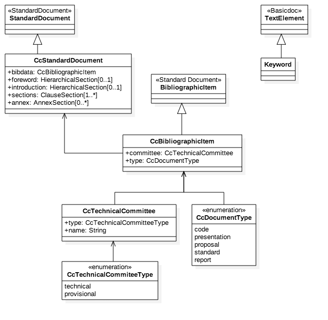

== The IsoDoc Document Model

[cols="2*"]
|===

a|
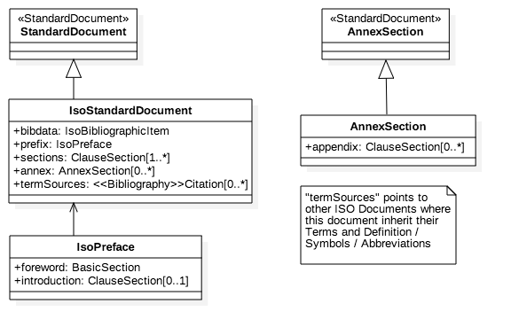

a|
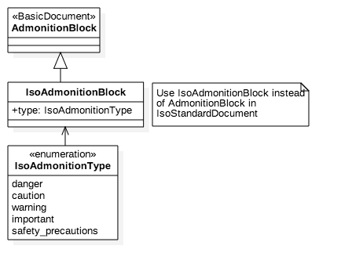

|===

== The IsoBibliography Document Model (metadata of document)

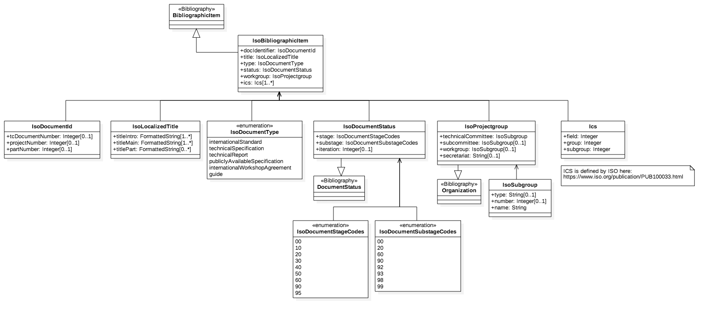

== The BasicDocument Document Model (Basic, 1/7)

[cols="2*"]
|===

a|

A `BasicDocument` is made of the following components:

* Elements
* Blocks
* Sections
* Document
* Document metadata (bibliographic information)
* Changes

a|

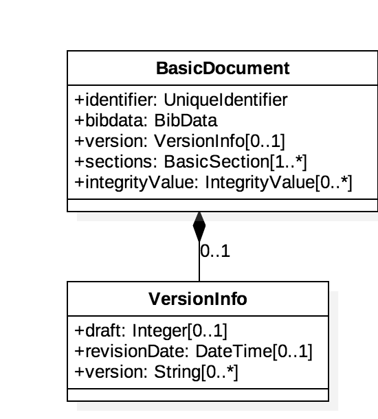

|===

== The BasicDocument Document Model (Changes and Security, 2/7)

[cols="2*"]
|===

a|
`BasicDocument` differs from today's documents as it allows
partial document representation and provides security features.

A `Change` is a modification action taken by a contributor on the document.
A `BasicDocument` itself can be represented as a series of `Changes`,
or a `BasicDocument` with `Changes`.

Security: every element, section, block and the document itself
allows integrity protection and non-repudiable signatures.

a|

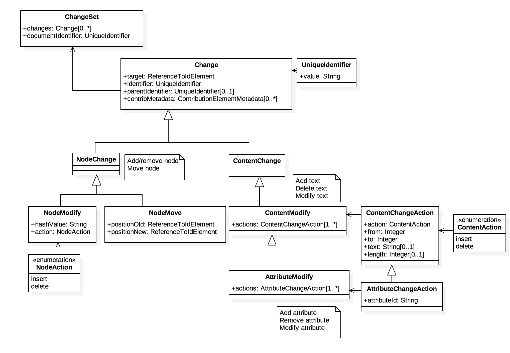

|===

== The BasicDocument Document Model (Sections, 3/7)

[cols="2*"]
|===

a|

A `BasicSection` contain blocks, sections and references.

a|

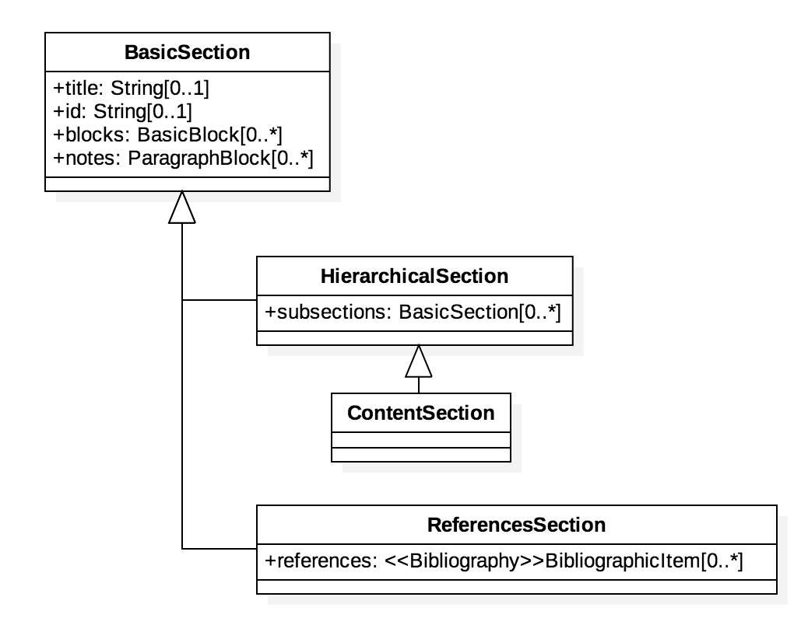

|===

== The BasicDocument Document Model (Blocks, 4/7)

Blocks are paragraphs and the likes.

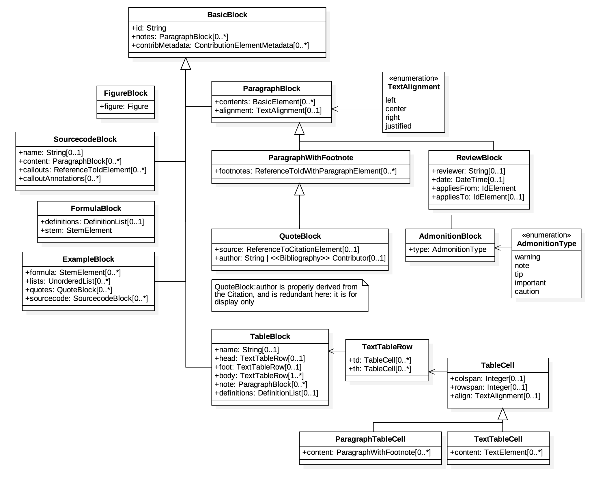

== The BasicDocument Document Model (TextElements, 5/7)

Elements are the basic building elements of `BasicDocument`.

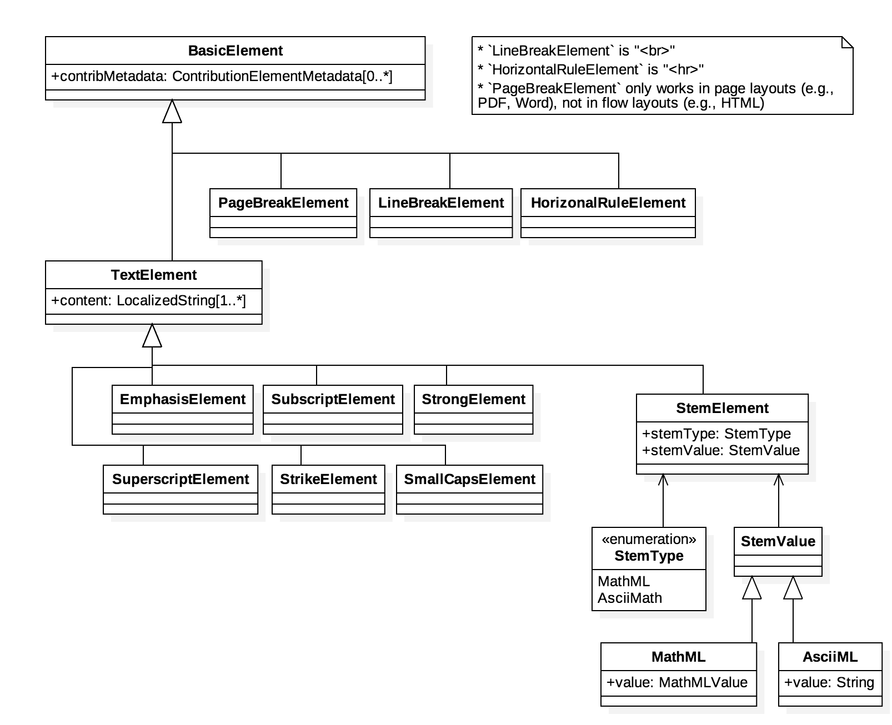

== The BasicDocument Document Model (IdElements, 6/7)

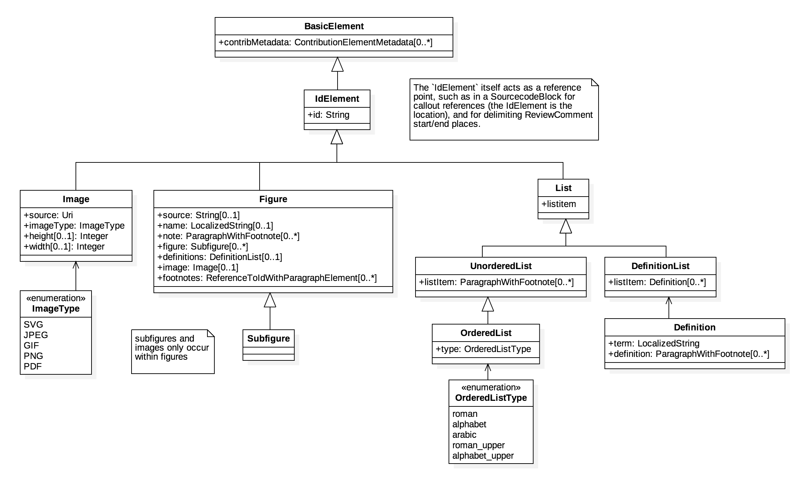

== The BasicDocument Document Model (ReferenceElements, 7/7)

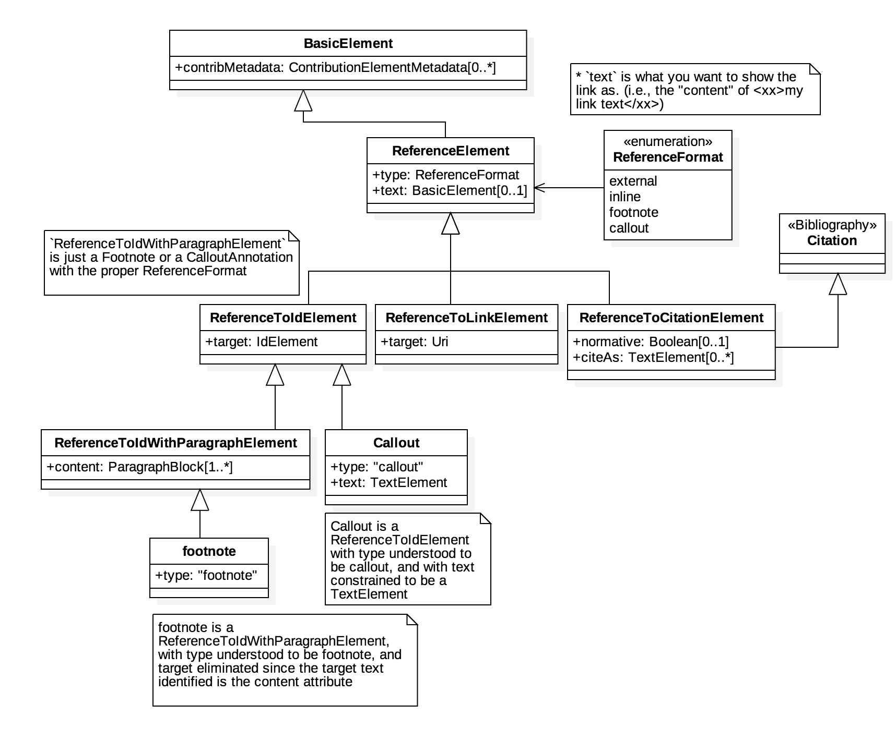

